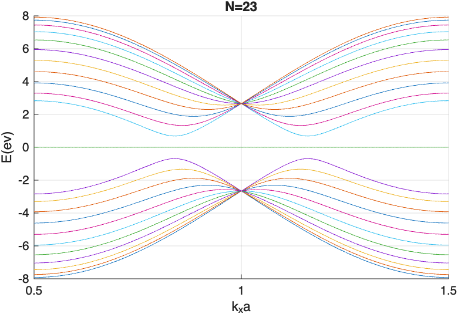
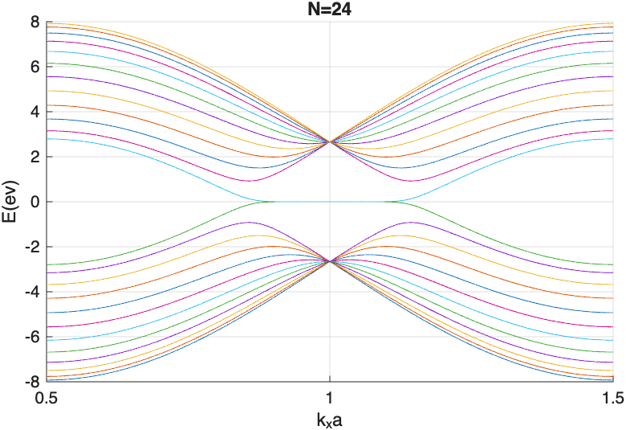
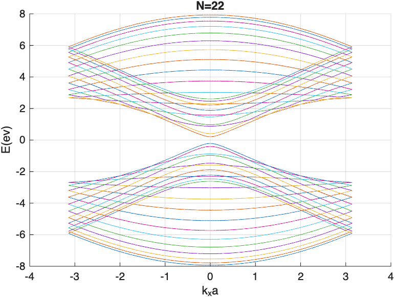
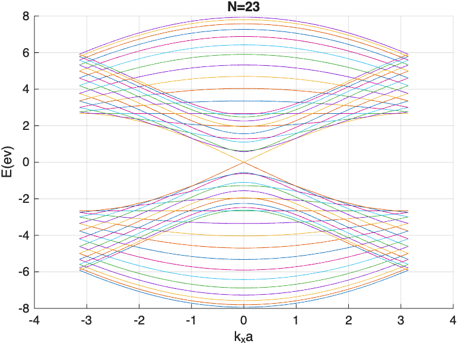
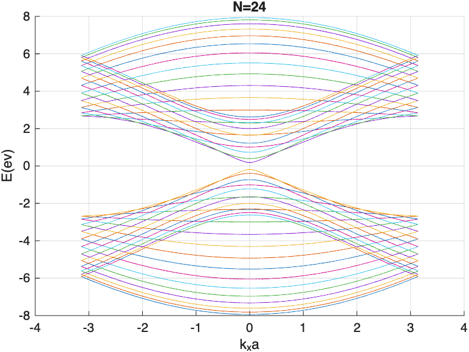

# Energy Spectrum of Graphene Nanoribbons

This project computes and plots the energy spectrum of graphene nanoribbons with **zigzag** and **armchair** edge terminations using a tight-binding model implemented in MATLAB.

## Zigzag Graphene Nanoribbon (ZGNR)
 The energy spectrum of a ZGNR features unique localized edge states at the Fermi level, making it inherently metallic. These edge states lead to a zero-energy band gap, but the specific spectrum changes with width (N), topological defects, and external fields.

### Results
---
Energy spectra for different ribbon widths:

  
  

## Armchair Graphene Nanoribbon (AGNR)
 AGNRs show a strong dependence of the energy spectrum on ribbon width. For N= 3p and 3p+1 the behaviour is semiconducting, while ribbons with n = 3p+2 display metallic or nearly gapless behavior.

### Results
---
Energy spectra showing width-dependent metallic behavior:

  
  
  

---

